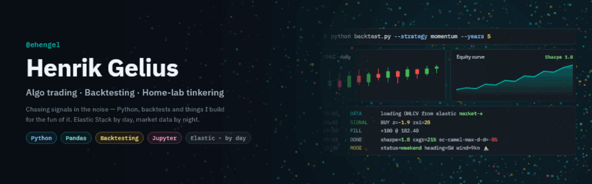

  

### Hi, I'm Henrik 👋

This is my corner of GitHub — where I tinker with **search, data and observability**,
mostly around the **Elastic Stack**. Expect experiments, learning projects, and the
occasional thing that turns out useful.

I've spent a good while in the Elastic world, so a lot of what I poke at here lives
somewhere between Elasticsearch, Kibana, logs and data pipelines.

---

#### 🛠 Mostly playing with

#### 🔎 Curious about

- **Search** — relevance, querying, making data findable
- **Security** — log management, detection, keeping an eye on things
- **Observability** — logs, metrics & tracing
- **Data pipelines** — ingesting and shaping messy data into something usable

---

📍 Sweden · 🌊 weekends out in the archipelago ⛵
